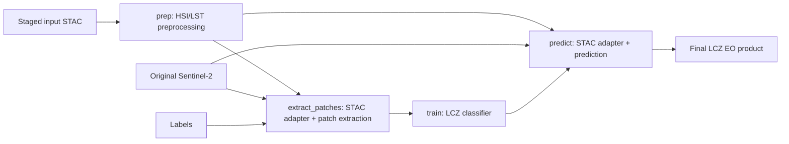

# heatwise-lcz-pipeline

Self-contained EOAP-oriented CWL workflow package chaining the three HEATWISE
LCZ processors into a single end-to-end workflow:

```text
heatwise-hsi-lst-prep
        |
        v
heatwise-patch-extraction
        |
        v
heatwise-lcz-classification train
        |
        v
heatwise-lcz-classification predict
```

EO products are exchanged between stages through STAC catalogs and staged CWL
`Directory` inputs/outputs.

The pipeline produces intermediate EO products for preprocessing, patch
extraction, and training, followed by the final LCZ classification product and
its STAC metadata.

## Relationship to the Processor Repositories

The scientific processors remain in three independent repositories:

- `heatwise-hsi-lst-prep`
- `heatwise-patch-extraction`
- `heatwise-lcz-classification`

This repository contains only the orchestration layer required to connect them
into the complete LCZ workflow.

The preprocessing and training stages use vendored CWL
`CommandLineTool` definitions:

- [tools/hsi_lst_prep.cwl](tools/hsi_lst_prep.cwl)
- [tools/lcz_train.cwl](tools/lcz_train.cwl)

The patch-extraction and prediction stages require small pipeline adapters:

- [tools/extract_patches_pipeline.cwl](tools/extract_patches_pipeline.cwl)
- [tools/predict_pipeline.cwl](tools/predict_pipeline.cwl)

Their Python glue code is stored in:

- [scripts/run_patch_extraction.py](scripts/run_patch_extraction.py)
- [scripts/run_predict.py](scripts/run_predict.py)

and baked into thin derived Docker images defined under [docker/](docker/).

No scientific processing implementation is duplicated in this repository.

## EOAP Data Flow

The pipeline uses staged STAC directories instead of configuration files
containing hard-coded raster paths.

The initial preprocessing input is a CWL `Directory` containing:

```text
catalog.json
STAC Item(s)
referenced EO assets
```

All asset hrefs in the sample STAC package are relative to the staged
directory.

For the Berlin example this directory is:

```text
data/Berlin_prep/
|-- catalog.json
|-- Berlin_item.json
|-- Berlin_CHIME.tif
|-- Berlin_LSTM.tif
`-- Berlin_S2.tif
```

The STAC Item exposes the input assets using the keys expected by the
preprocessing processor:

```text
hyperspectral_image
sentinel2
lst_source
```

The preprocessing stage generates a new STAC product containing the processed
hyperspectral and optional LST assets.

## Why Pipeline Adapters Are Needed

The output interface of the preprocessing processor is not identical to the
input interfaces required by patch extraction and LCZ prediction.

In particular, preprocessing exposes processed assets such as:

```text
hsi_bs
lst
```

while the downstream processors consume assets named:

```text
hsi
sentinel2
lst
```

The preprocessing output also does not propagate the original Sentinel-2
asset.

Therefore the pipeline uses lightweight adapters to connect the stages without
changing the scientific processors.

### Patch-extraction adapter

[scripts/run_patch_extraction.py](scripts/run_patch_extraction.py):

1. Reads the preprocessing output STAC catalog.
2. Resolves the processed `hsi_bs` asset and optional `lst` asset.
3. Combines them with the original staged Sentinel-2 image.
4. Creates a temporary STAC adapter catalog exposing `hsi`, `sentinel2`, and
   optional `lst`.
5. Injects the dynamically staged labels path into the patch configuration.
6. Runs the EOAP patch-extraction processor using `--input-catalog`.

The patch processor generates `patches.h5` and its output STAC catalog.

### Prediction adapter

[scripts/run_predict.py](scripts/run_predict.py):

1. Reads the preprocessing output STAC catalog.
2. Resolves the processed `hsi_bs` asset and optional `lst` asset.
3. Combines them with the original staged Sentinel-2 image.
4. Creates a temporary STAC adapter catalog for prediction.
5. Selects the requested trained checkpoint from the training output.
6. Runs the EOAP prediction interface using `--input-catalog` and `--weights`.

The classification processor writes the final LCZ map and its STAC metadata.

The temporary adapter catalogs exist only inside their corresponding pipeline
steps and are not final workflow products.

## Workflow



The top-level workflow is:

[heatwise_pipeline.cwl](heatwise_pipeline.cwl)

and exposes four stage outputs:

| Workflow output | Content |
|---|---|
| `prep_output` | Processed HSI/LST products and preprocessing STAC |
| `patch_output` | Patch HDF5 product and patch-extraction STAC |
| `train_output` | Model checkpoints, metrics, summary files and training STAC |
| `output` | Final LCZ classification product and prediction STAC |

## Repository Structure

```text
heatwise-lcz-pipeline/
|-- heatwise_pipeline.cwl
|
|-- tools/
|   |-- hsi_lst_prep.cwl
|   |-- lcz_train.cwl
|   |-- extract_patches_pipeline.cwl
|   `-- predict_pipeline.cwl
|
|-- scripts/
|   |-- run_patch_extraction.py
|   `-- run_predict.py
|
|-- docker/
|   |-- patch-extraction-pipeline.Dockerfile
|   `-- lcz-classification-pipeline.Dockerfile
|
|-- examples/
|   |-- job.yaml
|   |-- run_all_config_docker.yaml
|   |-- patch_config_template.yaml
|   |-- predict_config_template.yaml
|   `-- train_config_sample.yaml
|
|-- data/
|   |-- Berlin_prep/
|   |   |-- catalog.json
|   |   |-- Berlin_item.json
|   |   |-- Berlin_CHIME.tif
|   |   |-- Berlin_LSTM.tif
|   |   `-- Berlin_S2.tif
|   |
|   `-- Berlin_labels/
|
|-- .github/
|   `-- workflows/
|       `-- validate-pipeline.yml
|
|-- README.md
|-- LICENSE
`-- requirements.txt
```

## Example Job

[examples/job.yaml](examples/job.yaml) provides the complete job order used by
the end-to-end validation.

The preprocessing EO products are staged through:

```yaml
prep_input_catalog:
  class: Directory
  path: ../data/Berlin_prep
```

The original Sentinel-2 raster is also supplied explicitly to the downstream
adapters:

```yaml
sentinel2:
  class: File
  path: ../data/Berlin_prep/Berlin_S2.tif
```

This is necessary because Sentinel-2 is an input to preprocessing but is not
part of the preprocessing output STAC product.

The labels are staged independently as a CWL `Directory`.

## Container Images

The pipeline currently uses the following preprocessing image:

```text
ghcr.io/heatwise-lcz/heatwise-hsi-lst-prep:0.1.1
```

During EOAP integration testing, the patch-extraction and classification
processors use images built directly from their `eoap-compliance` branches:

```text
ghcr.io/esa-heatwise/heatwise-patch-extraction:eoap-compliance
ghcr.io/esa-heatwise/heatwise-lcz-classification:eoap-compliance
```

These tags are temporary integration-test references.

Once the corresponding upstream EOAP changes are merged and versioned images
are published, the temporary `eoap-compliance` references should be replaced
with the final release tags.

### Derived pipeline images

The two adapters are packaged as thin derived images:

```bash
docker build \
  -f docker/patch-extraction-pipeline.Dockerfile \
  -t ghcr.io/heatwise-lcz/heatwise-patch-extraction-pipeline:0.1.1 \
  .

docker build \
  -f docker/lcz-classification-pipeline.Dockerfile \
  -t ghcr.io/heatwise-lcz/heatwise-lcz-classification-pipeline:0.1.1 \
  .
```

These images contain only the pipeline glue scripts on top of their respective
scientific processor images.

The upstream EOAP processor images use `CMD`, allowing the CWL tools to invoke
the adapter scripts explicitly without modifying or clearing an upstream
`ENTRYPOINT`.

## Run the Full CWL Workflow

Prerequisites are Docker, `cwltool`, and access to the required GHCR packages.

From the repository root:

```bash
mkdir -p cwl-output

cwltool \
  --outdir cwl-output \
  heatwise_pipeline.cwl \
  examples/job.yaml
```

This is the same execution path exercised by the GitHub Actions integration
test.

## Validation

The workflow includes automated validation in:

```text
.github/workflows/validate-pipeline.yml
```

The validation performs:

1. Python syntax checks for the pipeline adapter scripts.
2. Validation of the staged preprocessing input STAC.
3. Validation of the top-level CWL workflow.
4. Validation of all vendored and adapter CWL tools.
5. Authentication and retrieval of the required GHCR processor images.
6. Verification of the EOAP command-line interfaces.
7. Construction of the two derived adapter images.
8. Execution of the complete CWL pipeline.
9. Validation of all generated STAC catalogs.
10. Verification of the required pipeline products.

The product checks require at least:

```text
patches.h5
best_model_*.pth
summary.csv
lcz_map.tif
```

## Current Validation Status

The complete LCZ workflow was successfully executed end to end in GitHub
Actions on 2026-08-28.

The successful integration test covered:

```text
STAC input
    ->
HSI/LST preprocessing
    ->
patch extraction
    ->
LCZ training
    ->
LCZ prediction
    ->
STAC output
```

The run successfully completed:

```text
CWL validation
input STAC validation
EOAP processor interface checks
adapter image builds
full CWL execution
output STAC validation
required product checks
```

This validates the repository-level CWL/Docker integration.

Execution on a target EOAP/APEx-compatible deployment environment remains a
separate platform-level validation step.

## Final Release Step

Before a final versioned release of this pipeline, replace the temporary
processor references:

```text
ghcr.io/esa-heatwise/heatwise-patch-extraction:eoap-compliance
ghcr.io/esa-heatwise/heatwise-lcz-classification:eoap-compliance
```

with the corresponding versioned images published after the upstream EOAP
changes are merged.

The full GitHub Actions validation should then be executed again before the
pipeline release is tagged.
